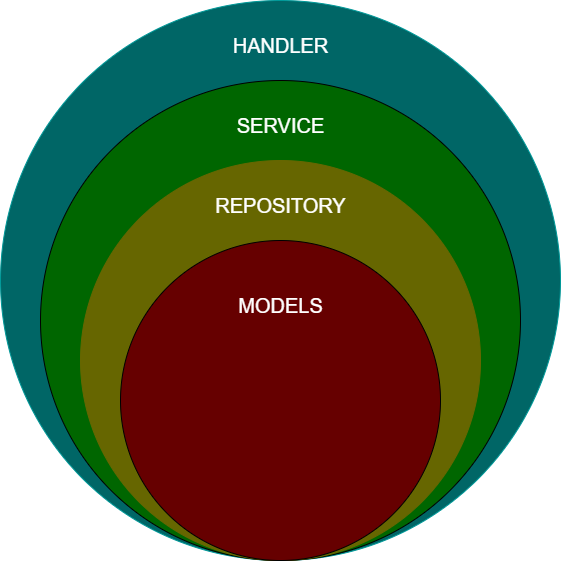

# Book REST API

This project is an example REST API that shows how to work with local and DB. As an architecture, Layered Architecture used.

<p align="center">
<a>
    
  </a>
</p>

This API contains 2 services: Book, Author

<br>

## Version

API has 2 version.

- Storing data locally **<base_url>/api/v1**
- Storing data in DB **<base_url>/api/v2**

<br>

## BOOK Endpoints

- GET ALL BOOKS

```cmd
Request: GET /api/v1/books

Response: {
    id:                 string
    title:              string
    description:        string
    publication_date:   string
    authorIDs:          string[]
}[]
```

- GET SINGLE BOOK WITH `id`

```cmd
Request: GET /api/v1/book/:id

Response: {
    id:                 string
    title:              string
    description:        string
    publication_date:   string
    authorIDs:          string[]
}
```

- SEARCH BOOKS (searching for `title` or `description` or `authorId`)

```cmd
Request: GET /api/v1/book/search/:search_text

Response: {
    id:                 string
    title:              string
    description:        string
    publication_date:   string
    authorIDs:          string[]
    authors             {
                            id:      string
                            name:    string
                            surname: string
                        }[]
}[]
```

- CREATE A BOOK

```cmd
Request: POST /api/v1/book
body {
    title:              string
    description:        string
    publication_date:   string
    authorIDs:          string[]
}

Response: {
    id:                 string
    title:              string
    description:        string
    publication_date:   string
    authorIDs:          string[]
}
```

- UPDATE EXISTING BOOK WITH `id`

```cmd
Request: PUT /api/v1/book/:id
body {
    title:              string
    description:        string
    publication_date:   string
    authorIDs:          string[]
}

Response: {
    id:                 string
    title:              string
    description:        string
    publication_date:   string
    authorIDs:          string[]
}
```

- DELETE EXISTING BOOK WITH `id`

```cmd
Request: DELETE /api/v1/book/:id

Response: {
    id:                 string
    title:              string
    description:        string
    publication_date:   string
    authorIDs:          string[]
}
```

## AUTHOR Endpoints

- GET ALL AUTHORS

```cmd
Request: GET /api/v1/authors

Response: {
    id:         string
    name:       string
    surname:    string
}[]
```

- GET SINGLE AUTHOR WITH `id`

```cmd
Request: GET /api/v1/author/:id

Response: {
    id:         string
    name:       string
    surname:    string
}
```

- SEARCH AUTHORS (searching for `name` or `surname`)

```cmd
Request: GET /api/v1/author/search/:search_text

Response: {
    id:         string
    name:       string
    surname:    string
    books:      {
                    id                  string
                    title               string
                    description         string
                    publication_date    string
                    authorIDs           string[]
                }[]
}[]
```

- CREATE AN AUTHOR

```cmd
Request: POST /api/v1/author
body {
    name:       string
    surname:    string
}

Response: {
    id:         string
    name:       string
    surname:    string
}
```

- UPDATE EXISTING AUTHOR WITH `id`

```cmd
Request: PUT /api/v1/author/:id
body {
    name:       string
    surname:    string
}

Response: {
    id:         string
    name:       string
    surname:    string
}
```

- DELETE EXISTING AUTHOR WITH `id`

```cmd
Request: DELETE /api/v1/author/:id

Response: {
    id:         string
    name:       string
    surname:    string
}
```

<hr>

For version 2, DB is not fully implemented, but these `2 endpoints` were implemented to show how using `MySQL DB` using in the code.

- GET ALL BOOKS

```cmd
Request: GET /api/v2/books

Response: {
    id:                 string
    title:              string
    description:        string
    publication_date:   string
    authorIDs:          string[]
}[]
```

- GET ALL AUTHORS

```cmd
Request: GET /api/v2/authors

Response: {
    id:         string
    name:       string
    surname:    string
}[]
```

## Running with DB

You need to have Docker Compose on your machine, then on the root folder:

- Building images

```cmd
docker compose build --no-cache
```

```Create and run containers
docker compose up
```
